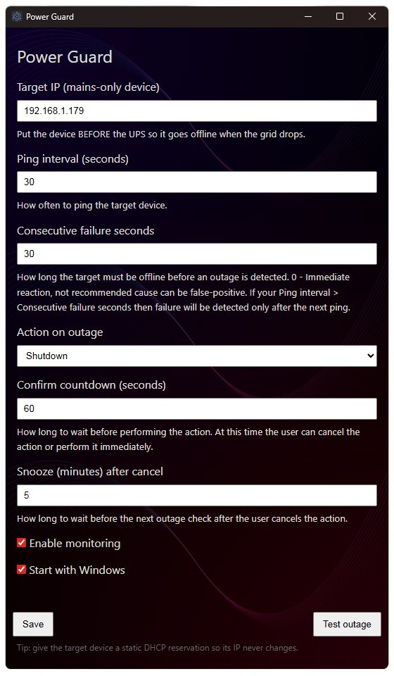
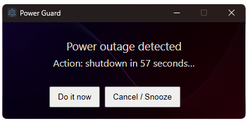

# Power Guard

## Description

An Electron application with electron-vite, ue and TypeScript for detecting grid power outages and managing system
state. App opens as hidden to tray from where you can Resume/Pause Monitoring, open settings or exit the app.

In UI you can configure next params:

- Target IP (should be some of your LAN devices)
- Ping Interval
- Consecutive failure seconds
- Action on grid outage
- Confirm countdown
- Snooze outage notification

You can configure startup on login and disable monitoring in settings.

When application detects grid power outage, it will show notification and start countdown to desired action.

## Use case

Your PC is behind UPS and you want to detect grid power outages and shutdown your PC to save power.
It will be usefull if you leave your PC on for long time and want to save UPS battery when grid is down.
Target IP should be some of your LAN devices, like router (maybe part of MESH system) or switch,
which is always on and connected to grid power.

## Supported OS:

- Windows

## Screenshots

### Settings



### Power outage detected



## Releases
You can download the latest release from [GitHub Releases](https://github.com/AlexStrilBy/power-guard/releases).

## Project Setup

### Install

#### NPM

```bash
$ npm install
```

#### Yarn

```bash
$ yarn install
```

### Development

#### NPM

```bash
$ npm run dev
```

#### Yarn

```bash
$ yarn run dev
```

### Build

To create electron build on Windows system your shell should be privileged (have admin right)

#### NPM

```bash
# For windows
$ npm run build:win
```

#### Yarn

```bash
# For windows
$ yarn run build:win
```
